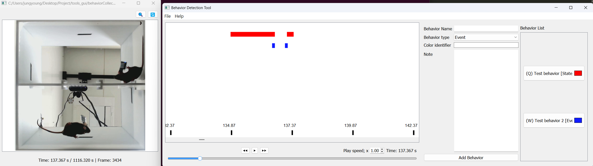

# behaviorCollector  
Simple GUI for selecting and annotating behavior from multiple videos.

`behaviorCollector` provides a video-based interface for labeling and exporting behavioral data from experimental recordings. It is particularly useful for analyzing animal behavior through user-defined labels and hotkeys.



---

# Installation

```bash
> pip install -e .
```

# Run
```bash
> collect_behavior
```
This will launch the main GUI window for behavior annotation.

# How to use it
## Load video and playback
1. Open the GUI using the `collect_behavior` command.
2. Use the File > Open Video menu or the folder icon to load a video file (e.g., `.mp4`, `.avi`).
3. The video player interface includes:
    - `Space`: Play / Pause
    - `H` / `L`: Frame-by-frame navigation
    - `K` / `J`: Slow down / Speed up
    - Slider: Jump to specific timestamp

For the full shortcut list, see `Help > Shortcut`.  
> **NOTE:** You can open multiple videos for simultaneous analysis, but make sure that their recording times are properly synchronized.

## Add behavior type
1. Use the panel on the right side of the GUI labeled `Behavior Name`, `Behavior Type`, `Color Identifier`, and `Note`.
- `Behavior Name`: Behavior name (e.g., `grooming`)
- `Behavior Type`: Behavior type
    - `State`: A duration-based behavior with a start and end (e.g., freezing, exploration)
    - `Event`: A point-in-time behavior marked with a single timestamp (e.g., jump, vocalization)
- `Color Identifier`: Hex color code (e.g., #ff2020)
- `Note`: Optional comment or description
2. Click ```Add behavior``` button to add it to the list on the right.

### Modify behavior type
To modify an existing behavior:
1. Click on the behavior you want to edit in the `Behavior List` on the right.
2. The selected behavior’s information will be loaded into the input fields on the left panel.  

Click the `Modify Behavior` button to apply the updates.

### Remove behavior type
To remove an existing behavior:
1. Click on the behavior you want to remove in the `Behavior List` on the right. 
2. `Clear behavior` button will be changed into `Remove behavior` button.
2. Click `Remove behavior` button.

## Save defined behavior types
1. After adding behavior types via the GUI, save them through ```File > Save Behavior Header```.
2. This exports a JSON file (header) containing behavior names, key mappings, and settings for future sessions.

## Select behavior timing
1. Press keys mapped to specific behavior types. You can find the mapped key in `Behavior List` panel.
2. While the video is playing or paused, press the key to mark the onset of a behavior.
3. (If the behavior type is `State`) Press the same key again to mark the offset.
4. Behavior intervals will appear in a timeline above the control panel.

If you click on an interval in the timeline, the video will jump to the start time of that behavior.


## Load pre-defined behavior types
1. Go to ```File > Load behavior header``` 
2. Select a previously saved JSON file containing behavior definitions and hotkeys.

## Load saved behaviors
1. Go to `File > Load behavior`
2. Select the directory containing the saved behavior files.

> **NOTE:** 
> - Make sure that the current behavior list is empty before loading saved behaviors.  
> - Make sure that a video is loaded before loading saved behaviors.

## Save selected behaviors
1. After labeling, click File > Save Behaviors or the save icon.
2. Select a directory to save all annotations behaviors.
3. Each behavior is saved as a seperated .json file with the following structure:
```json
{
    "name": "Behavior Test 1",
    "id": 0,
    "note": "Test 1",
    "type": "State",
    "video_path": [
        "C:/.../video_bot.avi",
    ]
    "color_code": "#ff2020",
    "time_ms": [
        [212519, 212719],
        [213399, 213559],
        [214959, 215159],
        [215839, 215999]
    ]
}

```
- name: Behavior name
- id: Behavior ID
- note: Optional description
- type: Behavior type ("State", "Event")
- video_path: List of video files that were open at the time of saving the behavior
- color_code: Assigned display color
- time_ms: A list of `[start, end]` times in milliseconds if `type` is `State`, or a list of time points if `type` is `Event`

## Export selected behavior scenes
To export only selected behavior epochs (e.g., a subset of behavior types), use:
```File > Export Selected Behavior epochs```
This will export:
- Clipped videos (.avi) for `State` behaviors
- Snapshot images (.jpg) for `Event` behaviors  

based on your annotation.

# Contact

Maintainer: jyKim-97  
For questions, suggestions, or bug reports, please open an issue in the repository.